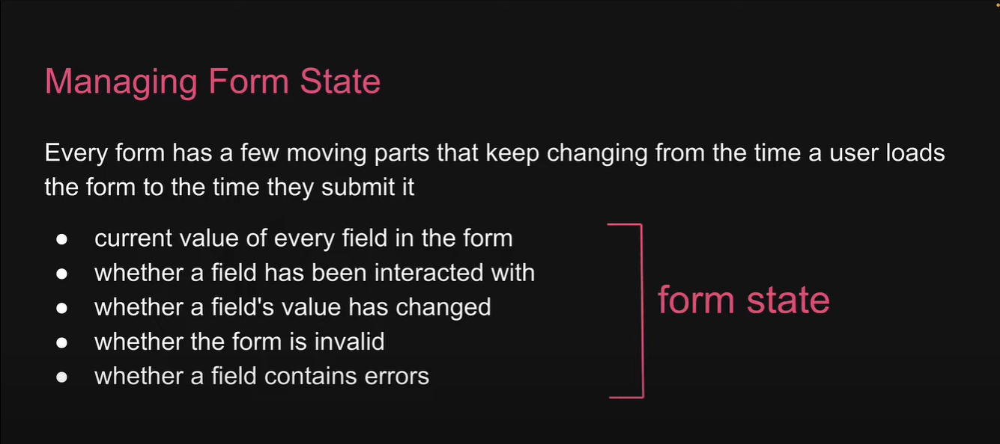

we in this repo we are using react-hook-form for handling form efficiently in react

to install this library write **npm i react-hook-form**

now we will import useForm hook from this package before start working for more on this hook see YoutubeForm component './src/components/YoutubeForm.tsx'

useForm hook in react-hook-form help us to manage form-state

we can use dedicated devtools for hookform for the data visualization of the form inputs
to intall that package we write npm i -D @hookform/devtools as dev dependencies for usecase visit './src/components/YoutubeForm.tsx'
